# UE4_Something
UE4.25它必须做点什么......
2020-07-29
:toc:

## 0. 概述
此项目用于尝试UE4.25引擎各种功能，和各种有趣的东西。

- Sequencer 定序器
- Niagara VFX
- Chaos

启用第三人称模板和初学者资源

文件目录如下

```
Content/                                    - UE4内容
    /Geometry                                   - 第三人称模板：几何体模型
    /Mannequin                                  - 第三人称模板：角色和动画
    /Sequencer                                  - 定序器资源
    /StartContent                               - 初学者资源
    /ThirdPerson                                - 第三人称模板：模型
    /ThirdPersonBP                              - 第三人称模板：蓝图和地图
    Niagara.umap                                - Niagara地图
    Sequencer.umap                              - 定序器地图
UE4_Something.uproject                      - UE4项目文件
```
## 1. Sequencer
Sequencer是虚幻引擎4的多轨迹编辑器，用于实时创建和预览过场动画序列。

Sequencer 编辑器使用户能够用专业的多轨迹编辑器（类似于Matinee）创建游戏内过场动画。通过创建 关卡序列（Level Sequences） 和添加 轨迹（Tracks），用户可以定义各个轨迹的组成，这样将确定场景的内容。轨迹可以包含动画（Animation）（用于将角色动画化）、变形（Transformation）（在场景中移动各个东西）、音频（Audio）（用于包括音乐或音效）和数个其他轨迹（Track）类型等。

### 1.1. 文件目录
```
Content/Sequencer/
    Master                                  - 主定序器：以下分镜的合成
    Shot0002_02                             - 分镜2的Take2：从远到近看人物正面
    Shot0002_03                             - 分镜2的Take3：从近到远看人物正面
    Shot01                                  - 分镜1：从下到上看人物背部
    Shot02                                  - 分镜2：从远到近看人物正面
    Shot03                                  - 分镜3：导轨360度环视人物
    Shot04                                  - 分镜4：人物运动，摇臂跟随
```

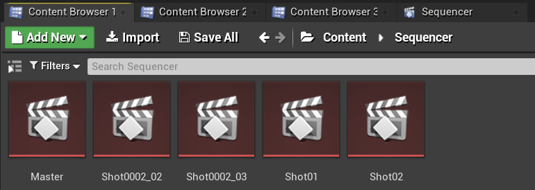

### 1.2. 快速入门
请查阅官方文档，讲的十分详细。这里只做简述。

#### 1.2.1. 创建Sequencer
从菜单栏创建定序器 Cinematics->AddLevelSequence，或者内容浏览器中 右键->Animation->LevelSequence

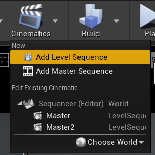
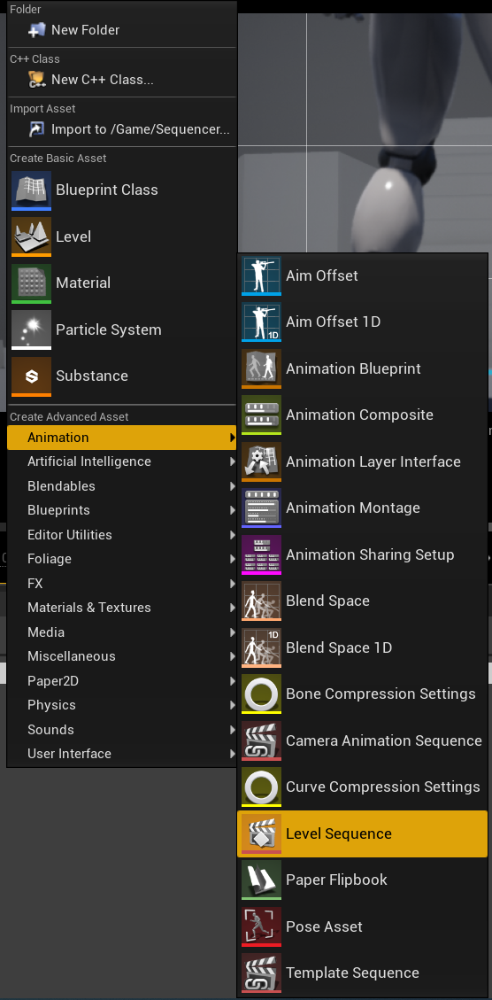

#### 1.2.2. 创建Shot1，使用角色动画
新建一个定序器，实现从后面看人物背部，从下到上的镜头。

1. 新建相机并设置相机位姿轨迹，焦点轨迹
2. 修改人物模型动画方式，由蓝图改为骨骼模型
3. 新建定序器中使用的人物模型，设置动画和轨迹

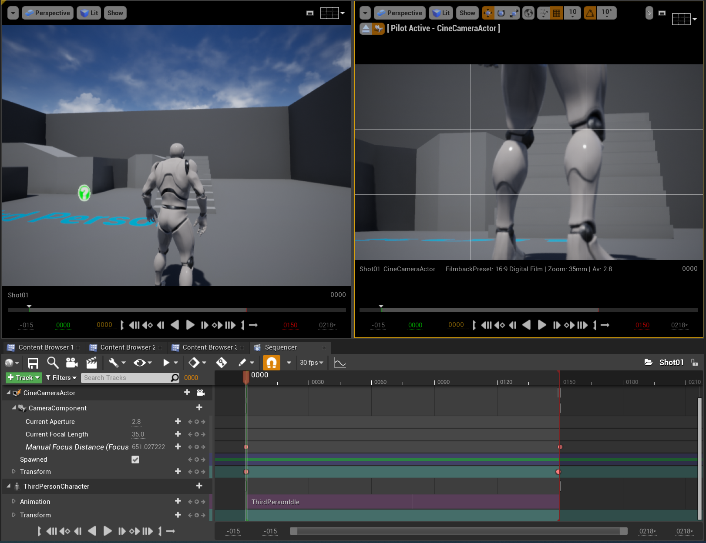

#### 1.2.3. 创建Shot2
新建一个定序器，实现从前面看人物脸部，从远到近的镜头。

#### 1.2.4. 创建Master，拼接Shot1和Shot2
新建一个定序器，先播放Shot1再播放Shot2。

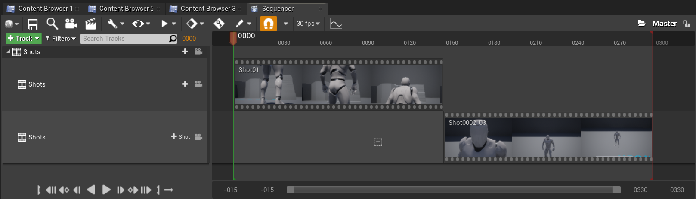

#### 1.2.5. 创建Shot2的Take2和Take3
右键Shot2片段，新建两个NewTake。可以选择Shot2使用的哪个Take，每个Take内容可以不一样。

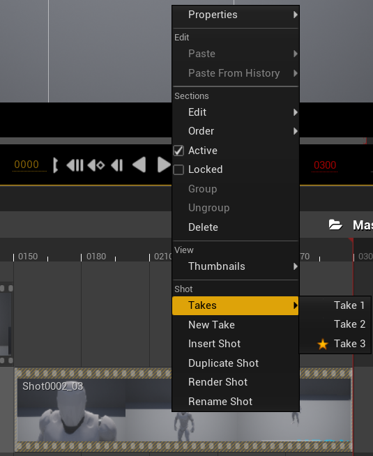

### 1.3. 渐变轨迹：淡入淡出
在Sequencer中点击添加轨道（+Track），选择消退轨道（FadeTrack）

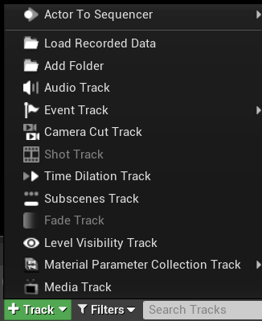

在FadeTrack中值1表示全黑，0表示正常显示。设置合适的关键帧，实现淡入淡出。

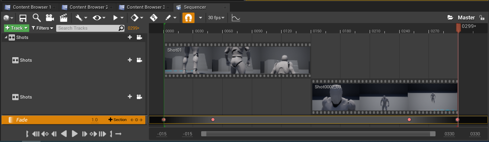

### 1.4. 角色动画：混合动画和属性

可以将多个动画混合在一起，让几个动画交叉就可以了。

在创建动画序列时，有时可能需要让场景中的某个角色移动或执行某种动画。 在 序列器（Sequencer） 中，这是通过将骨架网格Actor添加到关卡序列，然后添加动画子轨迹并指定希望Actor执行的动画来完成的。 序列器使您能够通过将一个属性轨迹拖放到现有属性轨迹，自动对动画（以及属性值）执行交叉渐变和混合操作。 这样做时，将应用自动混合，您可以通过使用缓和属性或定义自己的自定义曲线资源对其进行调优和调整。

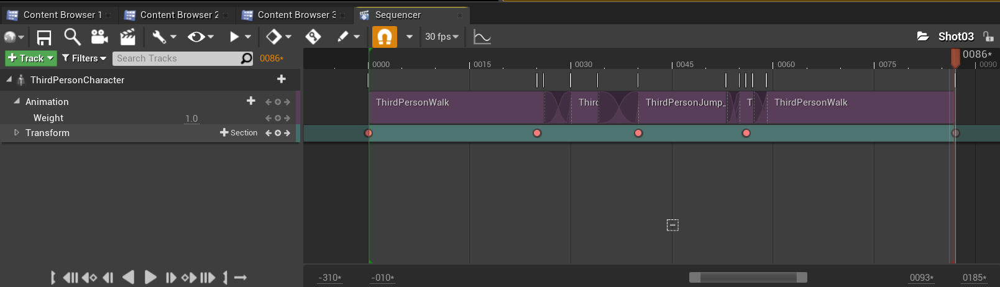

### 1.5. 音频轨迹
略。TODO

### 1.6. 摇臂和轨道
#### 1.6.1. 摇臂
真实场景制片人制作流畅扫描镜头的方法之一，就是将摄像机固定到摇臂上，通过摇臂的移动来控制镜头。您可以在Sequencer中使用 摄像机绑定摇臂（Camera Rig Crane） Actor和附带的 摄像机（Camera） 创建类似镜头。您可以设定绑定摇臂的绕X轴旋转、绕Y轴旋转或长度的关键帧，以及锁定挂载摄像机的绕X轴旋转或绕Y轴旋转（将跟踪摇臂的移动）。

先在场景中新增摇臂CameraRigCrane和电影相机CineCameraActor，并将电影相机附加在摇臂上。

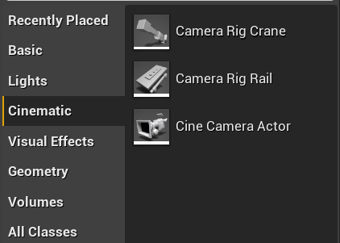

将摇臂与相机添加到新建的Sequencer，设置相应的关键帧，实现摇臂控制相机。

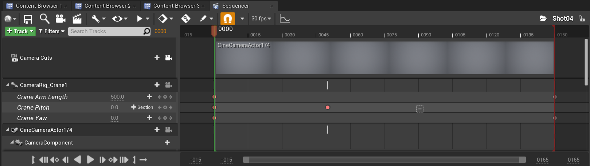

摇臂可以控制Pitch，Yaw，Length等。

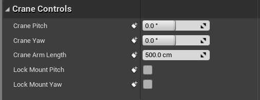

#### 1.6.2. 轨道
摄像机导轨 Actor 将摄像机连接到用于四处移动的导轨，可用来拍摄出飞越鸟瞰、360 度旋转或其他任何运动镜头。可以使用 样条组件 定义导轨的路径，在 Sequencer 中您还可以沿导轨为摄像机应该在任何给定时间所处的位置设置关键帧。

和摇臂类似，先在场景中新增导轨CameraRigRail和电影相机CineCameraActor，并将电影相机附加在摇臂上。将导轨与相机添加到新建的Sequencer，设置相应的关键帧。

导轨其实就是用Spline来制作的，方法和其他Spline组件一样。在导轨上新增轨迹，控制位置。

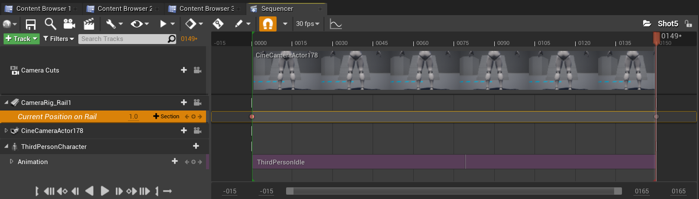

### 1.7. 播放速率轨迹
和渐变轨迹使用方法类似，都是通过在轨迹上设置常数关键帧来调整播放速率。在Sequencer中新增TimeDilation轨迹。
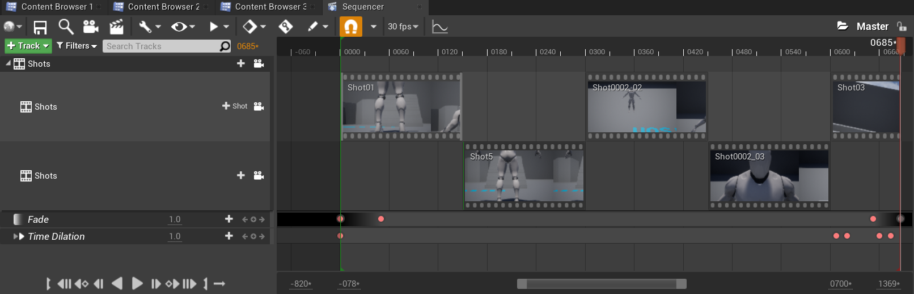

## 2. Niagara VFX
Cascade和Niagara都可用于在虚幻引擎(UE4)内创建视觉效果(VFX)，但从创建和调整VFX的方式来看，Niagara与Cascade有很大不同。

Niagara是虚幻引擎的次世代VFX系统。利用Niagara，技术美术师能够自行创建额外功能，而无需程序员的协助。我们将系统设计得具有更高适应性和灵活性，同时使其易用、易理解。

### 2.1. 文件目录
```
Content/Niagara/
    FX_FootstepDustPoof                         - Niagara粒子系统
    M_DustPoof                                  - 尘埃云材质
    云                                          - 尘埃云模型
```
### 2.2. 快速入门
#### 2.2.1. 创建粒子材质

使用ParticleColor节点作为基础颜色，PerlinNoise配合Step节点作为透明度的判断。材质属性设置为半透明

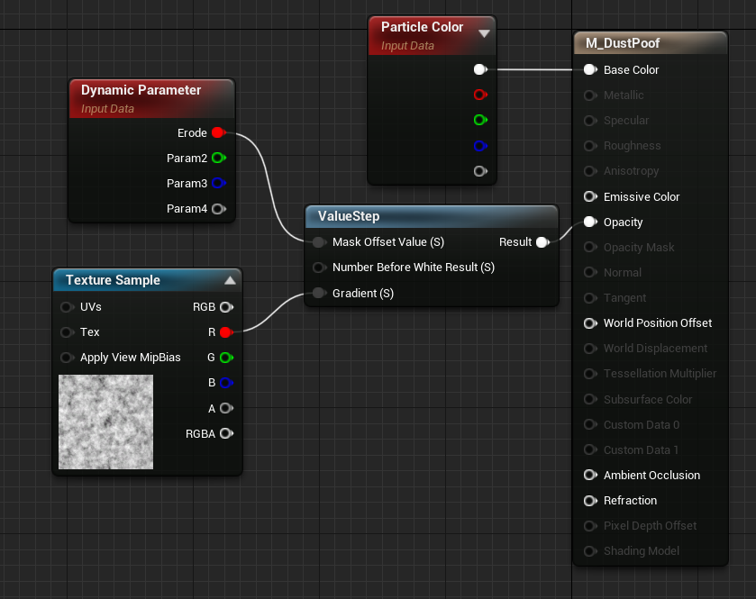

#### 2.2.2. 创建粒子系统

在内容浏览器中右键，新建粒子系统 FX/NiagaraSystem，选择第一项。模板选择SimpleSpriteBurst。

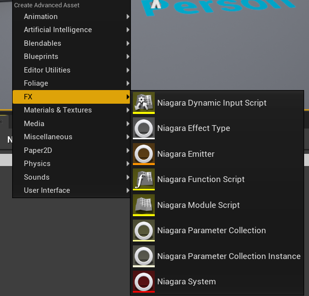
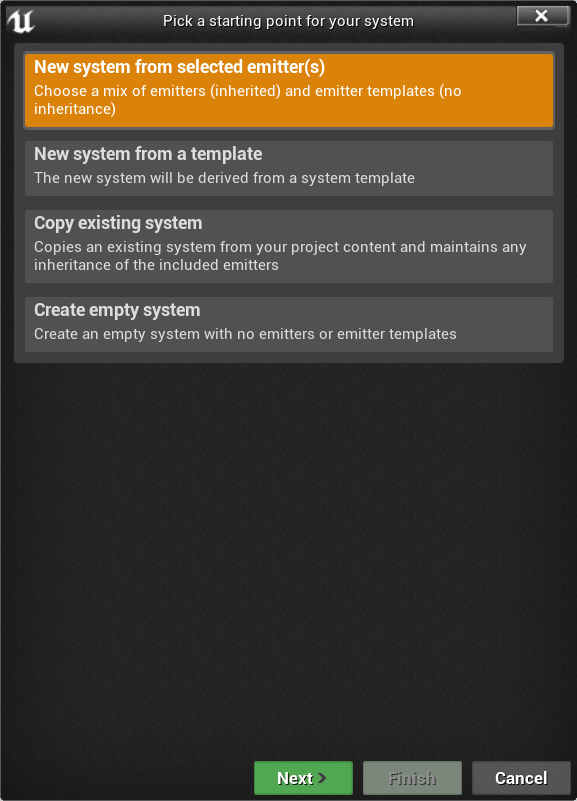

Niagara编辑器外观如下，每项设置详见官方文档Niagara快速入门。

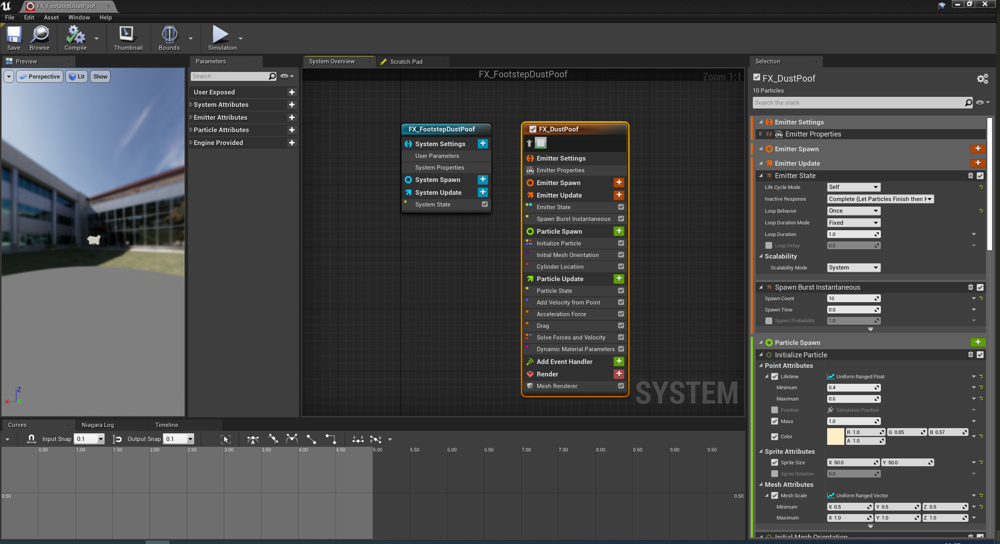

#### 2.2.3. 运用在动画中
找到第三人称模板角色使用的奔跑动画 Content/Mannequin/Animations/ThirdPersonRun。在左脚和右键刚离开地面的时候帧，设置通知 PlayNiagaraParticleEffect

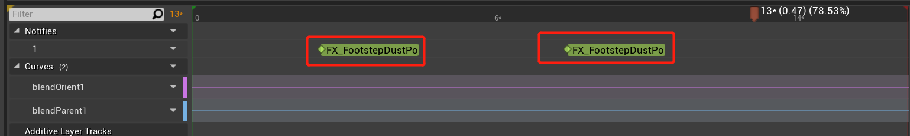
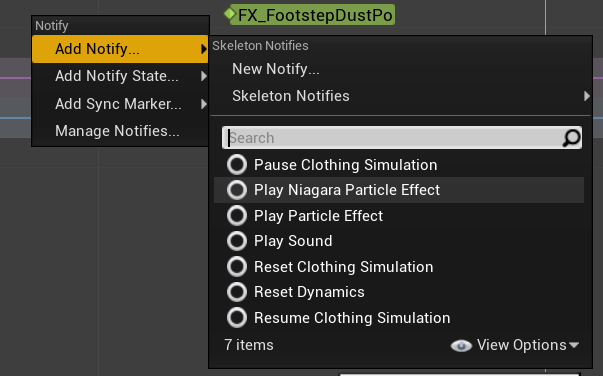

选择新增的通知，在右侧细节面板中，选择使用我们的NiagaraSystem，调整各项参数。实现在奔跑的时候，脚下生灰。

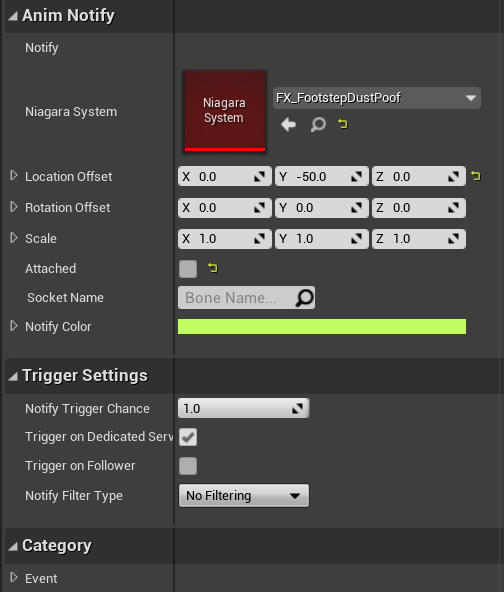

## 999. 参考资料
1. Sequencer快速入门：https://docs.unrealengine.com/zh-CN/Engine/Sequencer/QuickStart/index.html
2. Niagara快速入门：https://docs.unrealengine.com/zh-CN/Engine/Niagara/QuickStart/index.html